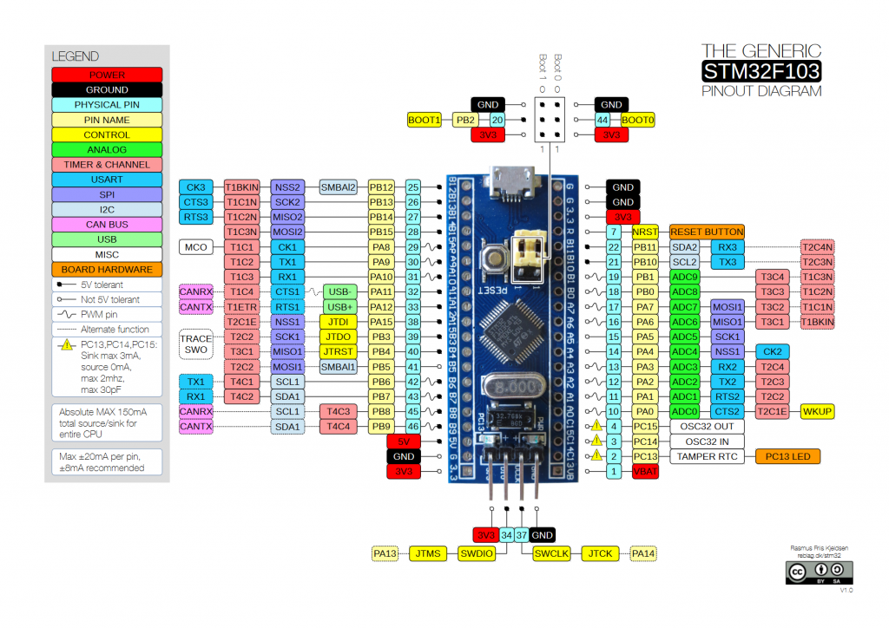
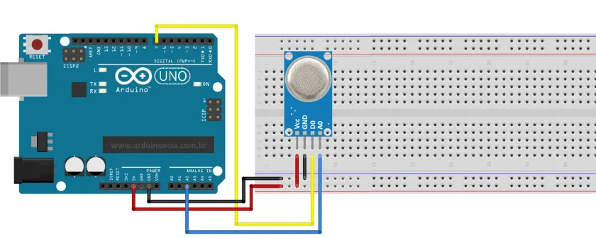

<div align="center">

# AirGuard STM32

## Sistema de Monitoramento de Qualidade do Ar com STM32 Blue Pill e MQ-135



<br><br>



</div>

---

## Integrantes

<table>
  <tr>
    <th>Nome</th>
    <th>Contribuição</th>
  </tr>

  <tr>
    <td>Victor Gomes da Costa</td>
    <td>
      Desenvolvimento do firmware embarcado, integração do sensor MQ-135,
      leitura ADC, lógica de classificação da qualidade do ar e documentação.
    </td>
  </tr>

  <tr>
    <td>Gisleno Junior</td>
    <td>
      Montagem do circuito eletrônico, testes de hardware,
      validação do sistema e auxílio na integração dos componentes.
    </td>
  </tr>
</table>

---

# Descrição do Projeto

O projeto <strong>AirGuard STM32</strong> consiste em um sistema embarcado desenvolvido utilizando a placa <strong>STM32 Blue Pill</strong> e o sensor de gases <strong>MQ-135</strong> para monitoramento da qualidade do ar em ambientes internos.

O sistema realiza:

<ul>
  <li>Leitura analógica do sensor MQ-135</li>
  <li>Processamento dos valores utilizando ADC</li>
  <li>Classificação da qualidade do ar</li>
  <li>Sinalização visual utilizando LEDs</li>
  <li>Alarme sonoro utilizando buzzer</li>
  <li>Sistema de calibração manual</li>
</ul>

---

# Objetivo

Desenvolver um sistema embarcado capaz de detectar alterações na qualidade do ar em tempo real utilizando os principais recursos estudados na disciplina de Microcontroladores.

---

# Tecnologias Utilizadas

<ul>
  <li>Linguagem C</li>
  <li>STM32CubeIDE</li>
  <li>STM32 HAL Library</li>
  <li>STM32F103C8T6</li>
  <li>Sensor MQ-135</li>
</ul>

---

# Componentes Utilizados

<table>
  <tr>
    <th>Componente</th>
    <th>Quantidade</th>
  </tr>

  <tr>
    <td>STM32 Blue Pill</td>
    <td>1</td>
  </tr>

  <tr>
    <td>Sensor MQ-135</td>
    <td>1</td>
  </tr>

  <tr>
    <td>LED Verde</td>
    <td>1</td>
  </tr>

  <tr>
    <td>LED Amarelo</td>
    <td>1</td>
  </tr>

  <tr>
    <td>LED Vermelho</td>
    <td>1</td>
  </tr>

  <tr>
    <td>Buzzer</td>
    <td>1</td>
  </tr>

  <tr>
    <td>Botão Push Button</td>
    <td>1</td>
  </tr>

  <tr>
    <td>Resistores</td>
    <td>Diversos</td>
  </tr>

  <tr>
    <td>Protoboard</td>
    <td>1</td>
  </tr>

  <tr>
    <td>Jumpers</td>
    <td>Diversos</td>
  </tr>
</table>

---

# Funcionalidades Implementadas

<ul>
  <li>Leitura analógica do MQ-135</li>
  <li>Conversão ADC de 12 bits</li>
  <li>Classificação da qualidade do ar</li>
  <li>Controle de LEDs</li>
  <li>Acionamento do buzzer</li>
  <li>Calibração do sensor</li>
  <li>Estrutura modular do firmware</li>
</ul>

---

# Classificação da Qualidade do Ar

<table>
  <tr>
    <th>Status</th>
    <th>Condição</th>
    <th>Ação</th>
  </tr>

  <tr>
    <td>Ar Bom</td>
    <td>Valor ADC baixo</td>
    <td>LED verde ligado</td>
  </tr>

  <tr>
    <td>Ar Moderado</td>
    <td>Valor ADC intermediário</td>
    <td>LED amarelo ligado</td>
  </tr>

  <tr>
    <td>Ar Ruim</td>
    <td>Valor ADC alto</td>
    <td>LED vermelho ligado + buzzer</td>
  </tr>
</table>

---

# Estrutura do Projeto

```txt
AIRGUARD_STM32/
├── Core/
│   ├── Inc/
│   │   ├── main.h
│   │   └── air_quality.h
│   │
│   └── Src/
│       ├── main.c
│       └── air_quality.c
│
├── imgs/
│   ├── mq-135.webp
│   └── stm32.png
│
└── README.md
```

---

# Ligações do Circuito

<table>
  <tr>
    <th>MQ-135</th>
    <th>STM32 Blue Pill</th>
  </tr>

  <tr>
    <td>VCC</td>
    <td>5V</td>
  </tr>

  <tr>
    <td>GND</td>
    <td>GND</td>
  </tr>

  <tr>
    <td>AO</td>
    <td>PA0</td>
  </tr>
</table>

<br>

<table>
  <tr>
    <th>Componente</th>
    <th>Pino STM32</th>
  </tr>

  <tr>
    <td>LED Verde</td>
    <td>PA1</td>
  </tr>

  <tr>
    <td>LED Amarelo</td>
    <td>PA2</td>
  </tr>

  <tr>
    <td>LED Vermelho</td>
    <td>PA3</td>
  </tr>

  <tr>
    <td>Buzzer</td>
    <td>PA4</td>
  </tr>

  <tr>
    <td>Botão de calibração</td>
    <td>PB0</td>
  </tr>
</table>

---

# Proteção do ADC

A placa STM32 Blue Pill trabalha com nível lógico de <strong>3.3V</strong>. Como a saída analógica do MQ-135 pode atingir valores próximos de <strong>5V</strong>, foi utilizado um divisor de tensão para proteger o ADC.

Exemplo:

```txt
MQ-135 AO ---- Resistor 10k ---- PA0 ---- Resistor 20k ---- GND
```

---

# Esquemático Simplificado

```txt
+------------------+             +----------------------+
|     MQ-135       |             |   STM32 Blue Pill    |
|                  |             |                      |
| VCC -------------+------------> 5V                   |
| GND -------------+------------> GND                  |
| AO --------------+------------> PA0 / ADC1_IN0       |
+------------------+             |                      |
                                 | PA1 -> LED Verde     |
                                 | PA2 -> LED Amarelo   |
                                 | PA3 -> LED Vermelho  |
                                 | PA4 -> Buzzer        |
                                 | PB0 -> Botão Calib.  |
                                 +----------------------+
```

---

# Funcionamento do Sistema

<table>
  <tr>
    <th>Condição</th>
    <th>Resposta do Sistema</th>
  </tr>

  <tr>
    <td>Ar Limpo</td>
    <td>LED Verde ligado</td>
  </tr>

  <tr>
    <td>Ar Moderado</td>
    <td>LED Amarelo ligado</td>
  </tr>

  <tr>
    <td>Ar Poluído</td>
    <td>LED Vermelho + buzzer</td>
  </tr>
</table>

---

# Principais Bugs Encontrados

<table>
  <tr>
    <th>Bug</th>
    <th>Descrição</th>
    <th>Solução</th>
  </tr>

  <tr>
    <td>Oscilação no ADC</td>
    <td>Os valores lidos variavam rapidamente.</td>
    <td>Leituras periódicas e filtragem simples.</td>
  </tr>

  <tr>
    <td>Aquecimento do sensor</td>
    <td>O MQ-135 necessita estabilização.</td>
    <td>Tempo inicial de aquecimento.</td>
  </tr>

  <tr>
    <td>Ruído elétrico</td>
    <td>Instabilidade no sinal analógico.</td>
    <td>Organização do aterramento e divisor resistivo.</td>
  </tr>

  <tr>
    <td>Falso acionamento do buzzer</td>
    <td>Pequenas oscilações ativavam o alarme.</td>
    <td>Definição de limites mínimos.</td>
  </tr>
</table>

---

# Lista de Tarefas Futuras

<ul>
  <li>Implementar média móvel</li>
  <li>Adicionar display OLED I2C</li>
  <li>Exibir valor ADC no display</li>
  <li>Adicionar UART para depuração</li>
  <li>Salvar calibração em memória Flash</li>
  <li>Implementar histórico de leituras</li>
  <li>Adicionar conectividade IoT</li>
  <li>Criar esquemático profissional no KiCad</li>
</ul>

---

# Link do Repositório

```txt
https://github.com/SEU-USUARIO/airguard-stm32
```

---

# Datasheet do Sensor MQ-135

```txt
https://www.handsontec.com/dataspecs/MQ-135%20Gas%20Sensor.pdf
```

---

# Como Executar o Projeto

<ol>
  <li>Abrir o projeto no STM32CubeIDE</li>
  <li>Configurar o microcontrolador STM32F103C8T6</li>
  <li>Configurar ADC no pino PA0</li>
  <li>Configurar GPIOs dos LEDs e buzzer</li>
  <li>Compilar o projeto</li>
  <li>Gravar utilizando ST-Link</li>
  <li>Montar o circuito conforme o esquemático</li>
  <li>Aguardar o aquecimento do sensor</li>
  <li>Realizar os testes com fumaça ou álcool</li>
</ol>

---

# Conceitos da Disciplina Utilizados

<ul>
  <li>GPIO</li>
  <li>ADC</li>
  <li>Sistemas embarcados</li>
  <li>Leitura de sensores</li>
  <li>Tratamento de sinais analógicos</li>
  <li>Controle de periféricos</li>
  <li>Programação em C</li>
  <li>Estruturação modular de firmware</li>
</ul>

---

# Ferramentas Utilizadas

<ul>
  <li>STM32CubeIDE</li>
  <li>STM32 HAL Library</li>
  <li>GitHub</li>
  <li>VS Code</li>
</ul>

---

# Licença

Projeto acadêmico desenvolvido para a disciplina de Microcontroladores.